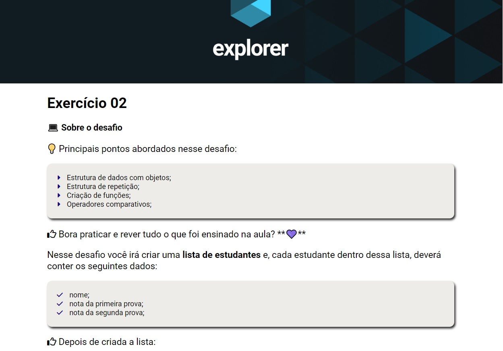

# Desafio do nível 04 - Exercicio 02 - Javascript

> Trilha Explorer 

> Projeto feito para cumprir desafio do nível 04 - <b>Exercicio 02 - Java Script</b> construído no curso Explorer da Rocketseat :rocket:. 

## :hammer_and_wrench: Tecnologias

- HTML
- CSS
- Git e Github

## :nut_and_bolt: Principais pontos abordados

- Estrutura de dados com objetos;
- Estrutura de repetição;
- Criação de funções;
- Operadores comparativos;

## :dart:  Desafio Javascript

- [ ]  Crie uma **função** que irá calcular a média das notas de cada aluno;
- [ ]  Supondo que a média, para esse concurso é **7**, verifique **se** cada aluno obteve sucesso ou não em entrar no concurso e mostre uma mensagem na tela.

## :mailbox_closed: Contatos

> Email - rosendc30@gmail.com

> Linkedin - https://www.linkedin.com/in/francisco-rosendo-a05623241/
